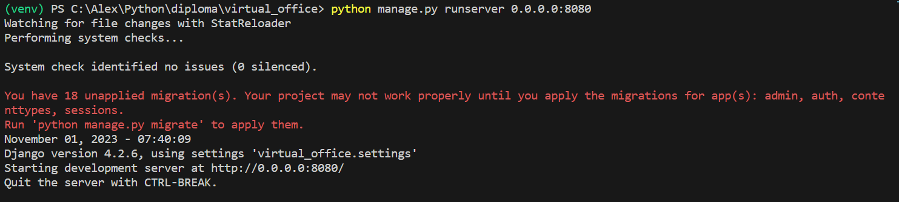
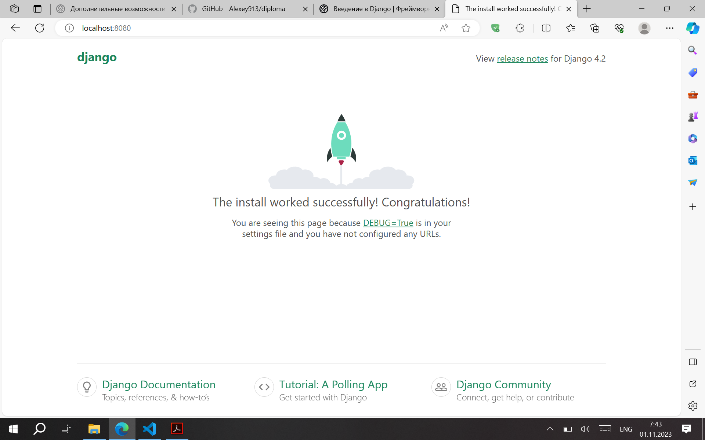
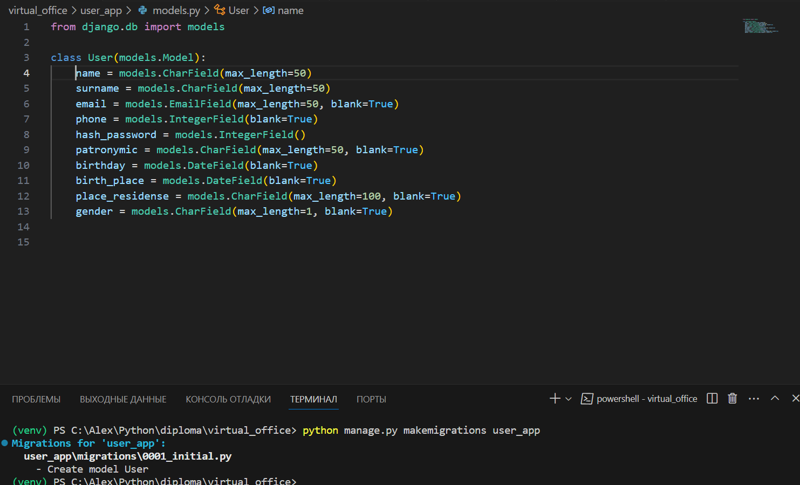
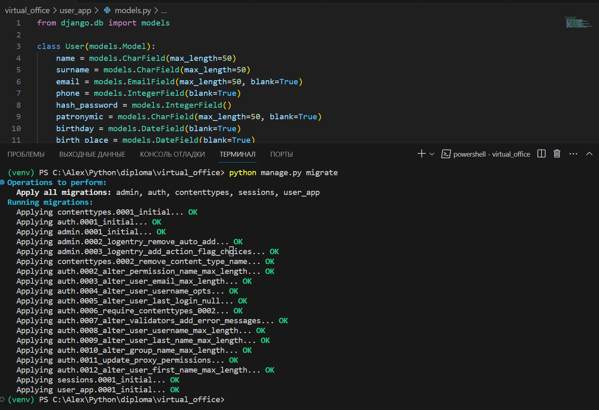
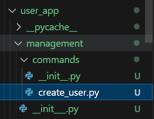

Методичка 1

# Настройка виртуального окруения
python -m venv venv
.\venv\Scripts\activate

# Установка фреймворка Django
pip install django

# Развертывание проекта
django-admin startproject virtual_office

cd vitrual_office
Настраиваем доступ через 0.0.0.0 - settings.py ->
ALLOWED_HOSTS = ['0.0.0.0',
                 'localhost'
                 '192.168.0.108']
0.0.0.0 - для развертывания проекта внутри сети и просмотра его с других устройств,
localhost - для перехода в приложения с базового компьютера,
192.168.0.108 - ip компьютера для запуска пиложенияс других устройств

# Создание приложения "Документы"
python manage.py startapp doc_app - создается папка doc_app
В файл settings.py добавляем приложение 'doc_app' в список INSTALLED_APPS
Добавляем в папку doc_app файл urls.py

В каталоге doc_app создаем каталог templates - здесь будет шаблон веб-приложения

# Проверяем работоспособность созданного проекта
python manage.py runserver 0.0.0.0:8080

В браузере по адресу localhost:8080 видим отображение успешного запуска приложения

Так как еще не настроены пути, отображается стандартное приветствие django

# Настройка путей
В файле urls.py каталога virtual_office импортируем функцию include из пакета django.urls.
В список urlpatterns добавляем строку path('', include('doc_app.urls')),
для подключения файла urls.py приложения doc_app.

# Логирование
Для логирования web-приложения в файле setings.py добавляем следующий франмент:

LOGGING = {
    'version': 1,
    'disable_existing_loggers': False,
    'formatters': {
        'verbose': {
            'format': '{levelname} {asctime} {module} {process} {thread} {message}',
            'style': '{',
        },
        'simple': {
            'format': '%(levelname)s %(message)s'
        },
    },
    'handlers': {
        'console': {
            'class': 'logging.StreamHandler',
            'formatter': 'verbose',
        },
        'file': {
            'class': 'logging.FileHandler',
            'filename': 'virtual_office_logger.log',
            'encoding': 'utf-8',
            'formatter': 'verbose',
        },
    },
    'loggers': {
        'django': {
            'handlers': ['console', 'file'],
            'level': 'INFO',
        },
        'doc_app': {
            'handlers': ['console', 'file'],
            'level': 'DEBUG',
            'propagate': True,
        },
    },
}

Описать, что для чего прописываем

Методичка 2
Создание БД, подтянуть к проекту MYSQL

Для работы в модели с полями IntegerField выполняем команду:
pip install pillow

Создаем приложние user_app
python manage.py startapp user_app
Добавляем в список приложений и т.д.

Создаем миграции для приложения user_app
python manage.py makemigrations user_app 

Применяем созданные миграции:
python manage.py migrate 

Создаем свои команды для проверки работоспособности сервера.
Для этого создаем в каталоге приложения user_app пакет management (в нем обязательное присутствие файла __init__.py), внутри создаем еще один пакет commands, в которм создаем файлы сервисных команд

Создаём класс Command как дочерний для BaseCommand. Переменная help выведет справку по работе команды. А метод handle отработает при вызове команды в консоли:

from django.core.management.base import BaseCommand

from user_app.models import User

class Command(BaseCommand):
    help = "Create user."

    def handle(self, *args, **kwargs):
        user = User(name='Иван', surname='Иванов',
                    email='mail@mail.ru', hash_password=8909876543, phone=9999)
        user.save()
        self.stdout.write(f'{user}')

Здесь мы создаем новый объект модели "User" с заданными значениями полей и сохраняем его в базе данных с помощью метода "save()". Далее выводим на печать сохранённого пользователя.
Если заглянуть в базу данных, таблица user_app_user получит новую запись.

Создаем еще read_user, update_user, delete_user
python manage.py create_user
python manage.py read_user 1
python manage.py delete_user 1
python manage.py update_user 1

Для удобства получения данных от пользователя необходимо оспользоваться формами.
Создаем файл forms.py в приложении user_app

Базовый шаблон проекта (методичка 3, стр. 19)